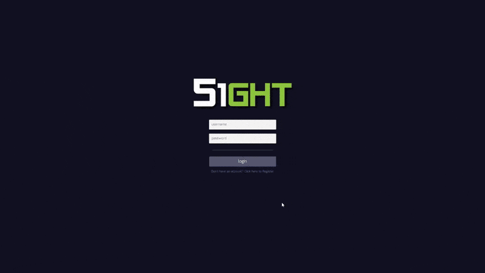

# 51GHT

Node application to document and discuss UFO sightings from around the world. Built with Express, MongoDB, Vue, and Mapbox. This was an educational project, you won't find much here.

todo: dockerize this thing and provide some setup instructions

